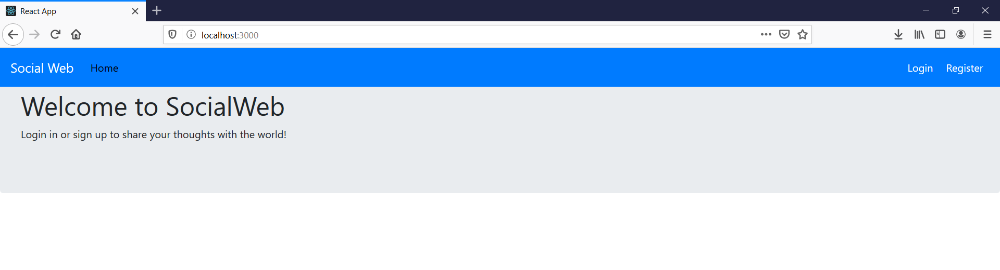
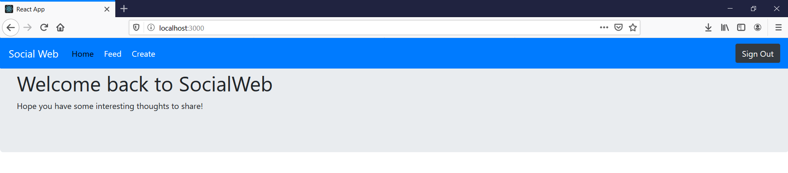
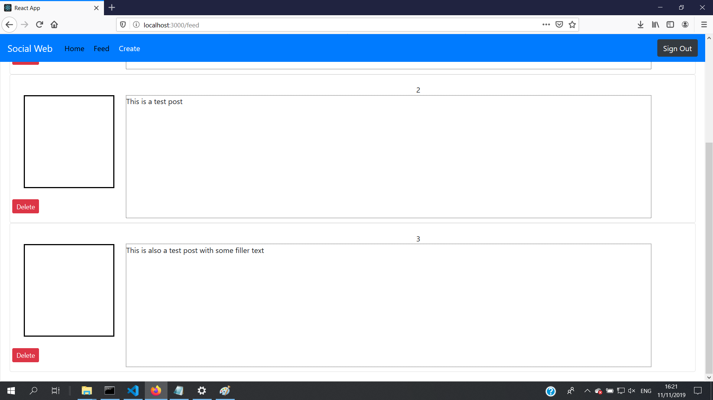
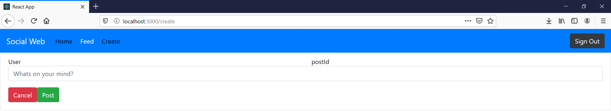
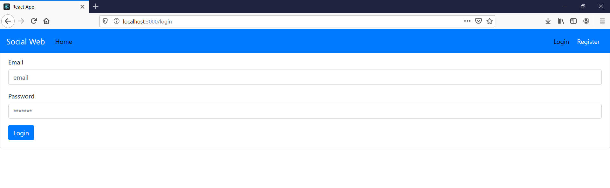
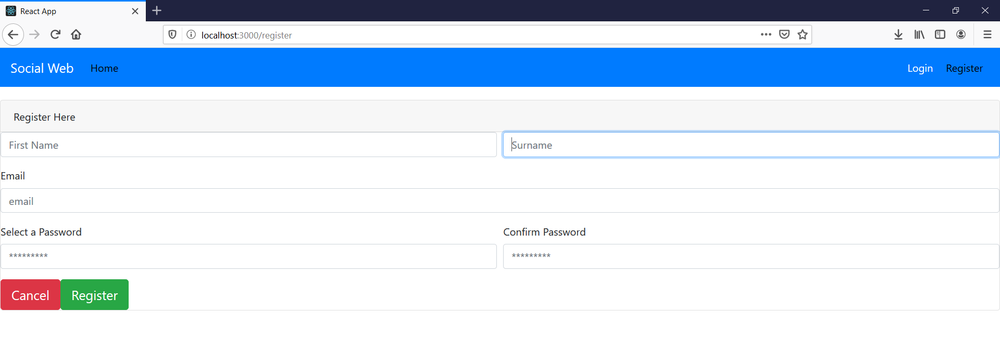

# BSc (Hons.) Level 8 - Assignment 1 - Single Page app.

Name: Austin Heraughty
## Overview.

Social Web app for making posts publically. Users can sign up to make or delete posts.

- Sign up
- Login/Signout
- Create and delete posts made to a public feed

## Setup.

. . . . Having cloned the repo, state the steps required to install and run the app . . . . .

## Data Model Design
~~~
          
          {FirebaseContextWrapper[App]}
                |
            [Navigation]
   _______________|________________________________________
   |           |           |           |                   |
[Feed]      [CreateForm]  [Login]   [REgistrationForm]  [SignOut]
   |
[Post]

~~~
Context API wraps app to keep track of user being logged in

## UI Design.

. . . . . Screenshots of the app's views with brief statements of their use (see examples below) . . . . . . .

>> Welcomes the user and encourages them to sign up. Nonauthorised Navbar seen at top of screen.

>> As before, but returned to following login. NAvbar options have changed.

>>Created posts listed here

>> This form used to take user input to post to feed

>> This form used to register a user as a member of the website through firebase

>> This form takes user data and registers them as site users

## Routing.

. . . . List each route supported by the app. For each one state the associated view and whether it's public/private (requires authentication) . . . . .

- / (public)- Welcome page - Public - Suggests login/registration, Private - Welcomes the user back
- /feed (private)- View all public posts made 
+ /create (private) - submit a new post 

## Storybook.

This is the expanded story tree. Many stories ceased to function after adding context wrappers giving a bizarre error with very little information.
 
 ~~~
 You may not use a outside of a 
 ~~~
 

## Backend 
Json serverstores posts made by users. Axios used to generate get, post and delete requests.

## Authentication

Firebase implemented for user registration. Signin/Signout handled by firebase, though no user personalisation implmented

